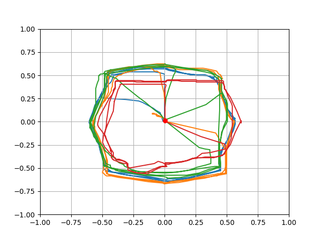

joystick-reader
===============

A simple CLI for reading and plotting joystick motion in real time.

I wrote this as fun side project to test my controller joysticks.


## Installation

```bash
pip install git+https://github.com/tjsmart/joystick-reader
```

## Running

```bash
joystick-reader
```


## Example

Below is an example output from four N64 joysticks. I've noticed
some issues getting full output on the up motion on the red joystick
which is confirmed by the plot below.


